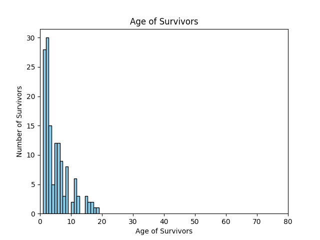
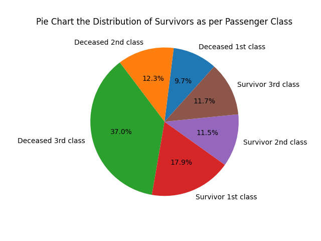
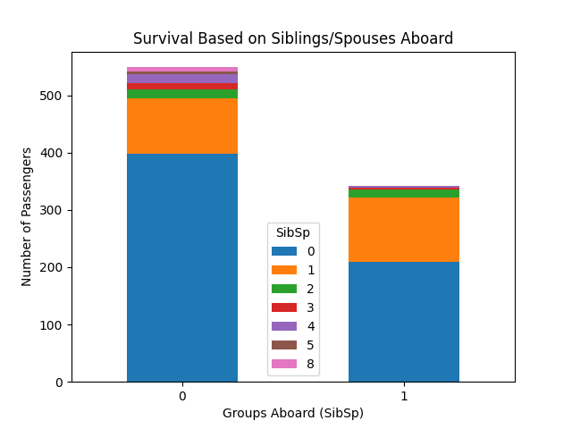
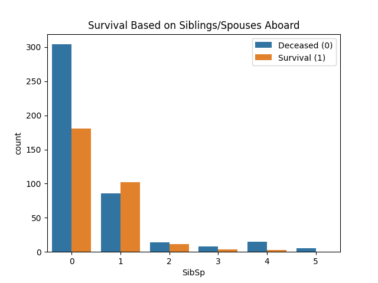
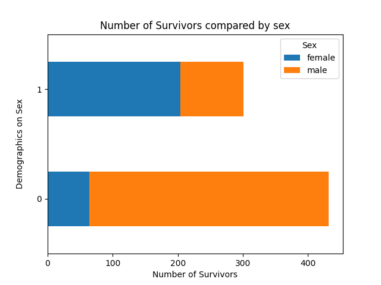
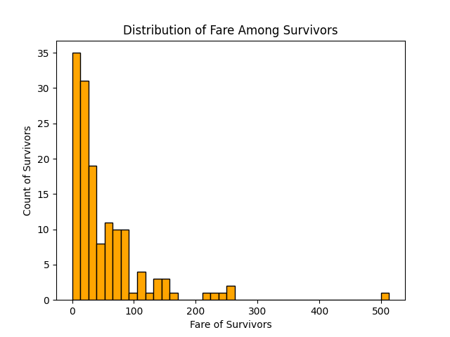
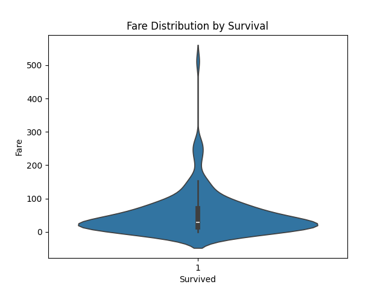
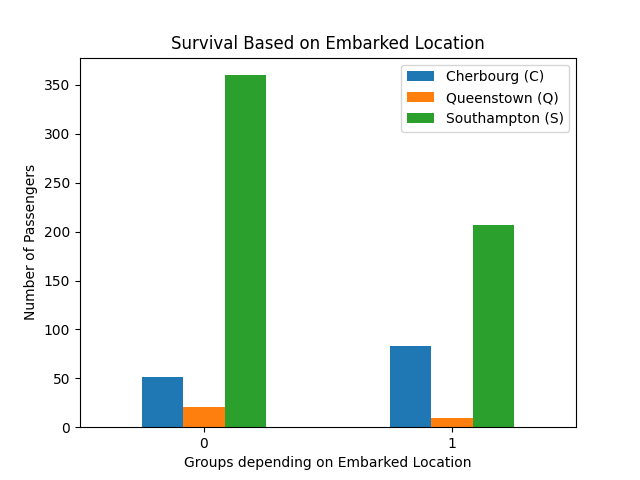
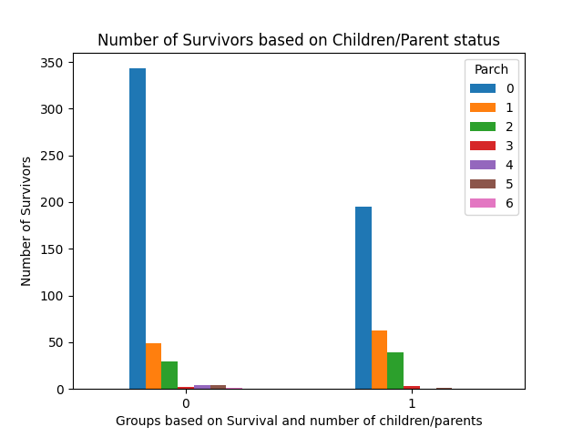

## Overview
- **Description**: The 1912 Titanic shipwreck, popularised in fiction with the 1997 James Cameron's film, resulted in a death toll of 1502 out of 2224 total passengers due to the limited number of lifeboats available. A dataset available via the links [Titanic Kaggle](https://www.kaggle.com/c/titanic/overview) and [Data Science Dojo Github](https://github.com/datasciencedojo/datasets/blob/master/titanic.csv), includes 12 variables and 891 rows representing a subset of the Titanic population.      

The Titanic variables included: `Name`, `Ticket Number`, `Passenger ID`, `Survival(0=No, 1=Yes)`, `Ticket Class(1 = 1st, 2 = 2nd, 3 = 3rd)`, `Sex`, `Age`, `Number of Siblings/Spouses Aboard`, `Parents or Children Aboard`, `Ticket Number`, `Passenger Fare`, `Cabin Number` and `Embarked Location(C= Cherbourg, Q = Queenstown, S = Southampton)`. Using the description available on Kaggle, `Age` was estimated and fractional if less than 1 years old. In relation to `Number of Siblings/Spouses Aboard`, only husbands and wives were considered, ignoring other relationships such as fiances. In relation to the variable, `Parents or Children Aboard`, some children only traveled with a nanny resulting in a zero values. 

The dataset contained missing values, especially in the `Age`, `Cabin` and `Embarked` columns. Thus, some of the results may be inconclusive as the complete dataset was unavailable. 

Through the use of the `Pandas`, `Numpy`, `Matplotlib` and `seaborn` packages, the Titanic Demographics were analysed and visualised. A combination of different visualisation techniques were employed including: histograms, pie charts, stacked and regular bar charts, and violin plots.  
For the full code, this can be accessed via the github account [Nathaniel Pyle](https://github.com/NathanielPyle/NathanielPyle.github.io)

## Methodology and Results

- **Technologies**: the packages that were used in this project were `matplotlib`,`Numpy`, `seaborn`, and `pandas`. 

- **Methods and Results**: The data was loaded into Python as a Panda's dataframe, where the `index_col = 0`. The original shape of the dataframe consisted of 891 rows with 12 columns. Using the 'dtypes' function in pandas, it was discovered that the columns were a combination of floats, integers and strings/objects, which was expected.

Using the 'check_nan' function in pandas, it was discovered was that there were NaN values present in the dataframe. If all rows were removed which contained NaN values, this would reshape of the Pandas dataframe from 891 rows to 183. This would significantly reduce the dataset by 79.46% and would be counterintuitive as this would reduce one's ability to conduct Exploratory Data Analysis on the various demographics of Titanic survivors. Therefore, an alternative approach was taken. 

Through a trial and error using different thresholds, using thresholds of 2, 3 , 9 and 10 did not change the number of rows in the Titanic dataframe. However using a threshold of 11 resulted in a reduction of 891 rows to 733. This indicates that most rows contained at least 11 valid values.  

Printing the sum of the missing data for all columns, it was discovered that the three columns which contained NaN data were `Age` at 177, `Cabin` at 687 and `Embarked` at 2. As previously mentioned, if these rows were removed which contained NaN values, this would reduce the findings for the other variables.

Thus, the alternative approach was to use a threshold of 11 to reduce the total number of rows to 733. This resulted in a decrease in NaN values in the following columns: `Age` from 177 to 19, `Cabin` from 687 to 529, and `Embarked` had no change. Overall, the number of NaN values was reduced from 866 in total to 550, and with a percentage decrease in 36.49%. In addition to this, NaN were kept as they did not significantly alter the Data Visualisation process. 

In addition to this, the following columns were dropped as they did not provide any additional insight into the Titanic survival rate: `Passenger ID`,  `Ticket Number`,`Name` and `Cabin`. Furthermore, no auxiliary metadata was presented about the nature of these variables which could influence the rate of survival.     

Survivor was paired with the seven variables/columns left in the Titanic Pandas dataframe: `Ticket Class(1 = 1st, 2 = 2nd, 3 = 3rd)`, `Sex`, `Age`, `Number of Siblings/Spouses Aboard`, `Parents or Children Aboard`, `Ticket Number`, `Passenger Fare`and `Embarked Location(C= Cherbourg, Q = Queenstown, S = Southampton)`. To accomplish this, the Pandas `groupby' function was used to create various `pandas.core.series` one dimensional arrays. For many of these series, they were unstacked where their structures were reshaped and converted into dataframes for ease with plotting.

Through the use of the `matplotlib`, `seaborn` and `numpy` packages, the following visualisations were created. 

- **Visualisations**:

**Histogram Age Demographics**:

**Pie chart Passenger Class**:

**Stacked Bar chart based on Siblings/Spouses Aboard**:

**Bar chart based on Siblings/Spouses Aboard**:

**Number of Survivors compared by Sex**:

**Fare Distribution Among Survivors**:

**Violin Plot Fare Distribution Among Survivors**:

**Bar Chart Survival Based on Embarked Location**:

**Bar Chart Survival Based on Children and Parent Status**:

## Discussion

From the visualisations, the most influential factors in Titanic `Survival` rates appear to be:

*`Age`: The histogram is right-skewed, showing that younger passengers had higher survival rates, especially those under ten years old.

*`Passenger Class: 37% of deceased passengers were in third class, compared to 12.3% in second class and 9.7% in first class, indicating that higher class passengers had a greater chance of survival. 

*`Sex`:Most of the deceased were male, suggesting a significant survival advantage for females.

*`Passenger Fare`: Passengers who paid lower fares had a higher likelihood of survival, although there were some anomalies.  

Further research could be conducted on:

*`Survival Based on Siblings/Spouses Aboard` There is little differentiation between groups, with the exception of those with no siblings or spouses aboard. 

*`Embarked Location`:  Southampton had significantly fewer survivors compared to other locations. Further investigation could clarify the cause of this disparity.

*`Parents or Children Aboard`: Results were generally consistent across groups, except for those with no parents or children aboard, who had fewer survivors.

## Further Links

For more information about the Pandas and Matplotlib packages please access the following urls.

[Pandas library](https://pandas.pydata.org/docs/index.html)

[Matplotlib library](https://matplotlib.org/) 

rmarkdown::render("Titanic.Rmd")
