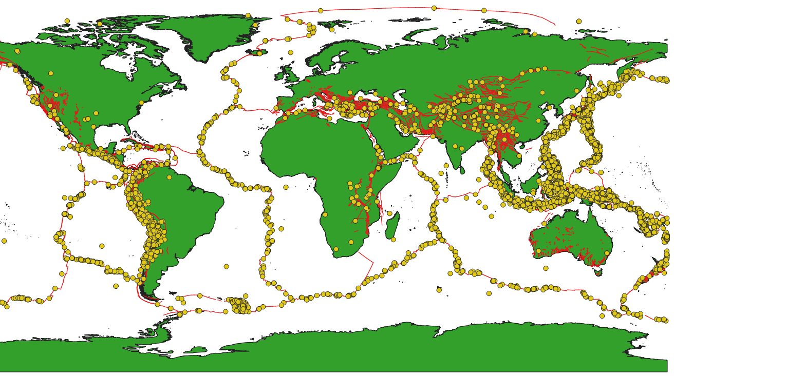
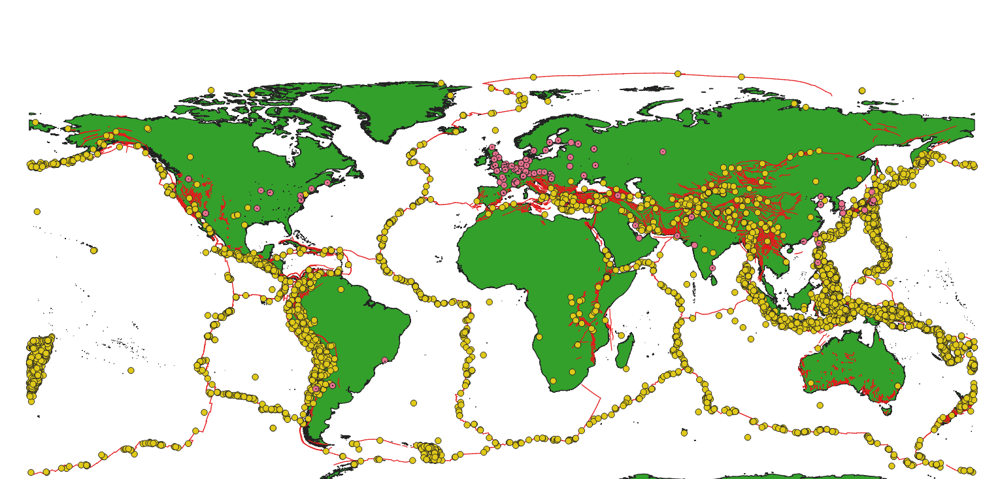
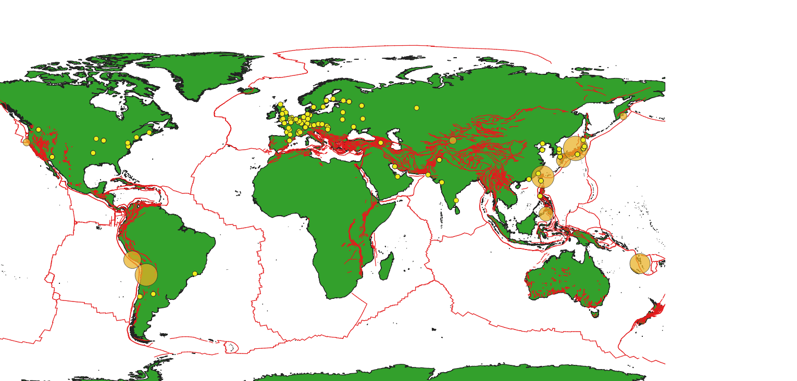
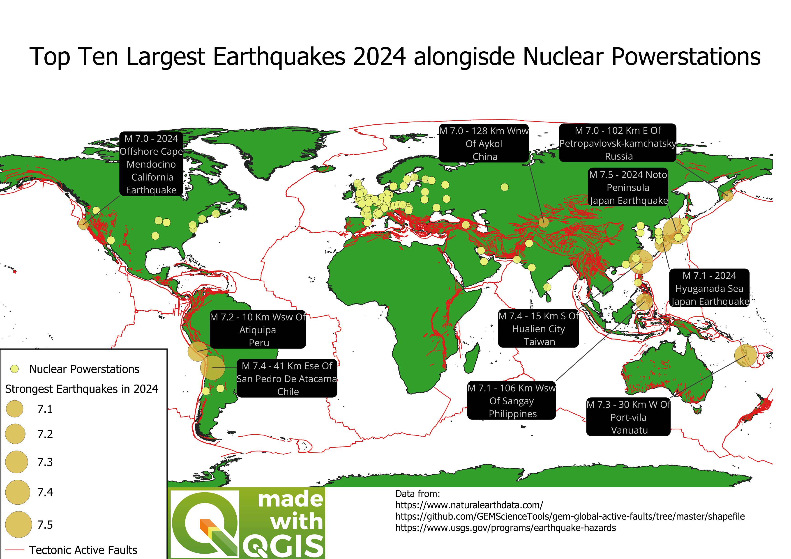
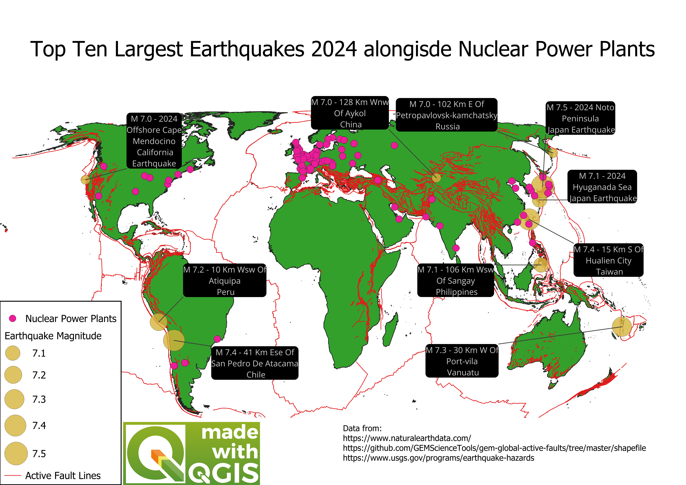

## Overview
- **Description**: The focus of this project was to explore the link between Earthquakes and Nuclear Power plants and uncovering any potential dangerous locations. There are three particular events which inspired this project: the 2011 Fukushima Daiichi Nuclear Power Plant disaster where a series of Earthquakes and Tsunami related events caused power outages making the power plant unstable,  the Chernobyl disaster of 1986 where due to a manufacturing defect the power plant became unstable, and the Christchurch 2010-2011 Earthquake period in New Zealand. In the last example, despite New Zealand having no nuclear power plants, it can be useful in warning other nations about the possibility of natural events and their potential effects on public infrastructure such as power outages.   

This project explores the number of Nuclear Power Stations in the world as of 2024, all tectonic fault lines and the top ten strongest earthquakes as per magnitude. To accomplish this, QGIS was implemented along with the use of various data sources including: 

* The GEM Science Tools shapefile for active tectonic plates available via [GEM Science Tools](https://github.com/GEMScienceTools/gem-global-active-faults/tree/master/shapefile)

* The United States Geological Survey Database available via [United States Geological Survey Database](https://earthquake.usgs.gov/earthquakes/search/) 

* The Natural Earth Database available at [Natural Earth Database](https://www.naturalearthdata.com/downloads/)

* The tutorials and learning materials made available by [Ujaval Ghandi](https://www.qgistutorials.com/en/) and his video [Introduction to QGIS](https://www.youtube.com/watch?v=pGm7w-LywO0&list=PLkFh-K-Ho_sIocsepjVMkDZhDwe5boO4n&index=4)

* The Open Street Map Packages available in QGIS

To access .png files/images, please feel free to access the following github account [Nathaniel Pyle](https://github.com/NathanielPyle/NathanielPyle.github.io)

## Limitations

This data may have been limited due to countries own privacy laws, especially those countries which deal with nuclear power, thus reducing data transparency along with the accuracy of the findings. As there was no description denying or proving this statement, one can only speculate about this. It is worth mentioning this here. 

## Methodology and Data

- **Methodology and data**: Using the desktop version of GGIS 3.34.13 a new project was created with various plugins installed. For more information about the particular processes in this project, please see the tutorials and learning materials link in the above description. The Natural Earth shapefile for `ne_10m_land` was used to create a `Polygon/Multipolygon` layer which everything would be built upon. Through the use of the`gem_active_faults` shapefile, a `Line/Multilinestring` was used to show all active tectonic fault lines throughout the world. The GeoJson file from the United States Geological Survey Database was used to create `Point/Pointz` on top of this layer. The options used to generate this GeoJson were: 4.5 Magnitude, from 2024-01-01 00:00:00 to 2024-31-12 23:59:59 with all other constraints staying the same. The reason behind leaving all other constraints the same was that these would be filtered later in QGIS and would not influence the results. It is unlikely that a man-made event would cause an earthquake related event that would influence the top values. The total number of earthquakes from this period with a magnitude over 4.5 were 6315, where the top 10 strongest earthquakes had a magnitude between 7.0 to 7.5. Each earthquake was labeled, scaled and noted in the ending poster. It should be noted that the scale method was flannery as it seemed the most appropriate out of all possible options. In relation to the magnitude values, these were used as the basis of the legend in the poster. Through the use of the Quick QGIS extension, nuclear power stations were searched for using the following query: `plant:source` = `nuclear`. This resulted in three layers being added, including: `Polygon/Multipolygon`,`Line/Multilinestring` and a `Point/Pointz`. As this projected only involved nuclear stations and not the territories of nuclear stations, all layers except for the `Point/Pointz`were removed. In addition to this, the project coordinate reference system was changed to `WGS 84 / Equal Earth Greenwich` to ensure an accurate portrayal of the globe which has a limited accuracy of at best 2 meters as noted in the documentation. 

The labels, colour options and other particular stylistic choices were trialed and tested. These can of course be altered and changed to one's own personal preference. Over the course of this project, these themes were changed and altered to be show the data available.

## Results

- **Results**: Analysing the total number of earthquakes in 2024 without nuclear power stations, there are a lot of regions that experience high volume of earthquakes such as Japan, Chile and South East Asian countries such as the Philippines and Indonesia. Therefore, one would conclude that these regions would have fewer nuclear power plants than other regions as the threat of an earthquake related event could potentially interfere with the power plant operations. This is surprisingly not the case as there are various exceptions to this rule. In Asia, especially Japan, Taiwan and the Philippines are all regions with high volumes of earthquake activity yet they have nuclear power plants. To improve the findings, data about each nuclear power plant's safety protocols such as backup generators for power outages, if the power plant have a failsafe protocol and other data would improve the findings of the results. As limited data was available, one can only speculate which regions look dangerous if a nuclear power plant is damaged by an earthquake related event. 

- **Visualisations**:

**2024 Earthquakes and tectonic zones**:

**2024 Earthquakes, nuclear power plants and tectonic zones**:

**2024 Earthquakes scaled, nuclear power plants and tectonic zones**:

**Draft Poster**:

**Finished Poster**:

rmarkdown::render("earthquakes_powerplants.Rmd")
