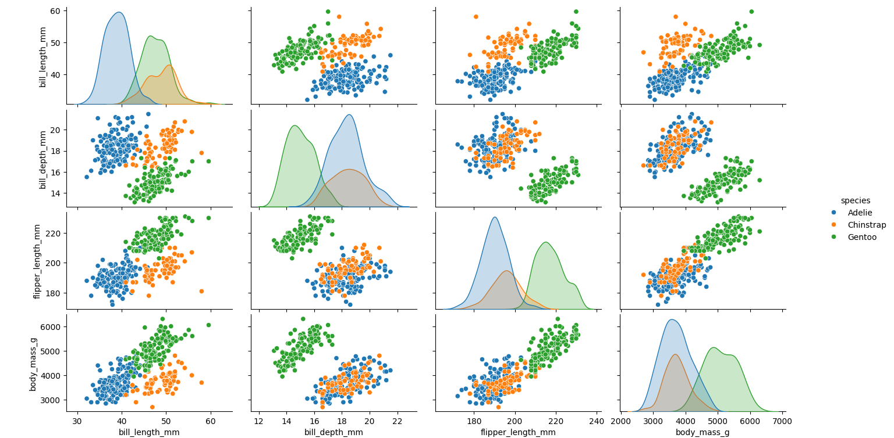

## Overview
- **Description**: Description: In nature, variations within species often arise due to differences in habitat, sex, and other environmental influences. The Palmer Penguins dataset, available via the link [Palmer Penguins](https://github.com/allisonhorst/palmerpenguins), was originally collected and made available by Dr. Kristen Gorman and the Palmer Station Antarctica Long Term Ecological Research Network. This dataset comes in two forms: a simplified version and a raw version with a full set of variables. For this project, the simplified dataset was used.  

The dataset contains 344 penguin observations, with 7 key variables: species, island, bill length (mm), bill depth (mm), flipper length (mm), body mass (g), and sex. In the simplified dataset, missing values were represented as NaN. The dataset includes three penguin species—Adelie, Gentoo, and Chinstrap—found on three different islands: Biscoe, Dream, and Torgersen. There was an unequal distribution of species, with Adelie penguins being the most common at 146, followed by 119 Gentoo penguins and 68 Chinstrap penguins. The islands also had different sample sizes, with Biscoe hosting 163 penguins, Dream 123, and Torgersen 47. The ratio of male to female penguins was almost equal, with 168 males and 165 females. 

The aim of this project was to explore the differences in penguins' body weights and flipper lengths using Python packages, particularly Pandas, Seaborn, and Matplotlib. Several data visualisation techniques were used, such as descriptive statistics, scatter plots, box plots, and pair plots.
For the full code, this can be accessed via the github account [Nathaniel Pyle](https://github.com/NathanielPyle/NathanielPyle.github.io)

## Methodology

- **Technologies**: the packages that were used in this project were `matplotlib`, `seaborn`, and `pandas`. 

- **Methods and Results**: The data was loaded into Python using Seaborn's 'load_dataset()' function as a pandas dataframe. Since the dataset contained missing values, where NaN values were present, any rows that contained an NaN were dropped. This resulted in a dataset with 333 rows, 11 fewer than the original dataset, named as valid data. 

The first scatter plot showed that there was great variation in the body weight of penguins compared with the other physical features. As a result, body weight was chosen as the primary focus of this project to investigate its relationship with various factors.

After separating the penguins by sex, two distinct clusters emerged in both male and female groups. For male penguins, the clusters were divided into those weighing above and below 5000 grams. For females, the division was at 4000 grams. 

These differences between the four samples sizes were visualised using box plots. For male penguins over 5000 grams, the median value was approximately 5500 grams compared with the median value of penguins under 5000 grams at approximately 4000 grams.

In relation to female penguins under 4000 grams, the median value was approximately 3400 grams, compared with female penguins above 4000 grams at 4700 grams.

It should be noted that there was a lot of variation in these box plots. An alternative method was used to search for a specific sample of the valid dataset. The results from this search were then plotted using both a scatter and a box plot. 

Seaborn's pair plot function was used to visualise the relationships between species, sex, and island, providing a comprehensive overview of the dataset. Additional pair plots were generated to explore the relationships between body weight and flipper length, bill length, and bill depth.

Using Seaborn's pair plots was computationally more efficient than manually generating search queries for each subset. Manually generating queries would have required creating 18 specific queries (2 for sex, 3 for species, and 3 for islands, leading to 2 x 3 x 3 combinations), which would have been computationally inefficient. 

- **Visualisations**:

**Variation among penguins physical features**:

**Scatter plot for male penguins Body Mass versus Flipper Length**:

**Scatter plot for female penguins Body Mass versus Flipper Length**:

**Box plot for male penguins 5000 grams and under**:

**Box plot for male penguins over 5000 grams**:

**Box plot for female penguins 4000 grams and under**:

**Box plot for female penguins above 4000 grams**:

**Specified scatter plot**:

**Specified Box plot**:

**Pair plots using species **:

**Pair plots using sex**:

**Pair plots using island**:

**Pair plots using flipper length and body mass**:

**Pair plots using bill length and body mass**:

**Pair plots using bill depth and body mass**:

## References 

- **Data Originally published in**:
Gorman KB, Williams TD, Fraser WR (2014). Ecological sexual dimorphism and environmental variability within a community of Antarctic penguins (genus Pygoscelis). PLoS ONE 9(3):e90081. https://doi.org/10.1371/journal.pone.0090081

## Data Citations

- **Adelle Penguins**:
Palmer Station Antarctica LTER and K. Gorman, 2020. Structural size measurements and isotopic signatures of foraging among adult male and female Adélie penguins (Pygoscelis adeliae) nesting along the Palmer Archipelago near Palmer Station, 2007-2009 ver 5. Environmental Data Initiative. https://doi.org/10.6073/pasta/98b16d7d563f265cb52372c8ca99e60f (Accessed 2020-06-08).

- **Gentoo penguins**:
Palmer Station Antarctica LTER and K. Gorman, 2020. Structural size measurements and isotopic signatures of foraging among adult male and female Gentoo penguin (Pygoscelis papua) nesting along the Palmer Archipelago near Palmer Station, 2007-2009 ver 5. Environmental Data Initiative. https://doi.org/10.6073/pasta/7fca67fb28d56ee2ffa3d9370ebda689 (Accessed 2020-06-08).

- **Chinstrap penguins**:
Palmer Station Antarctica LTER and K. Gorman, 2020. Structural size measurements and isotopic signatures of foraging among adult male and female Chinstrap penguin (Pygoscelis antarcticus) nesting along the Palmer Archipelago near Palmer Station, 2007-2009 ver 6. Environmental Data Initiative. https://doi.org/10.6073/pasta/c14dfcfada8ea13a17536e73eb6fbe9e (Accessed 2020-06-08).

## Further Links

For more information about the Pandas and Matplotlib packages please access the following urls.

[Pandas library](https://pandas.pydata.org/docs/index.html)

[Matplotlib library](https://matplotlib.org/) 