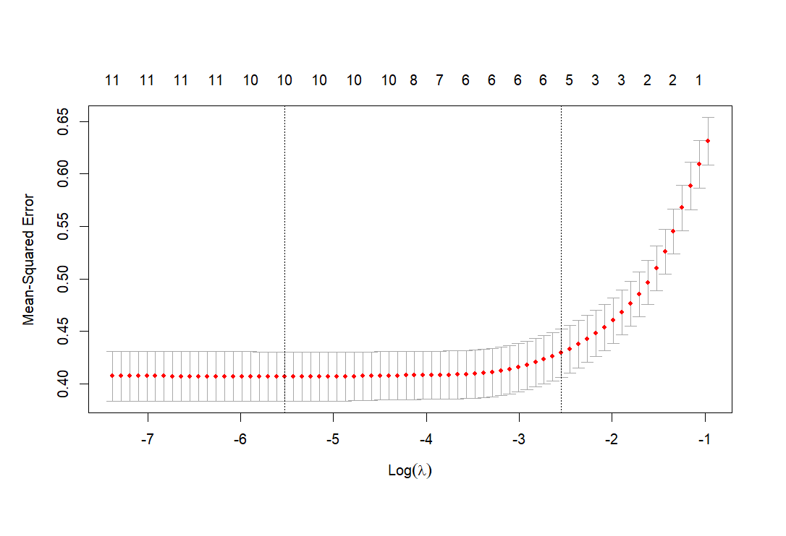

## Overview
- **Description**: The quality of wine is determined by various features that relate to its taste, aroma, and other characteristics familiar to wine experts. The UC Irvine Wine Dataset, available at [UC Irvine Wine Dataset](https://archive.ics.uci.edu/dataset/186/wine+quality), consists of two datasets: one for white wine and one for red wine. These datasets evaluate wine quality using physicochemical tests and sensory variables, focusing on the red and white variants of Portuguese Vinho Verde wine.

The dataset includes 11 features and one dependent variable, the wine quality score. The features, which are based on physicochemical inputs and sensory data, include: fixed acidity, volatile acidity, citric acid, residual sugar, chlorides, free sulphur dioxide, total sulphur dioxide, density, pH, sulphates, and alcohol. These measurements were taken based on sensory evaluations, with a median score determined from at least three wine experts' assessments.

Each expert graded the wine samples on a scale from 0 (very bad) to 10 (excellent). Due to privacy and logistical constraints, only physicochemical inputs and sensory outputs are available in this dataset. No information about grape type, wine brand, or other confounding variables is provided.

Notably, the datasets contains no missing data.

The aim of this project was to identify the key variables that influence wine quality. To achieve this, various data science techniques were applied, including correlation matrices, subset selection, model evaluation, stepwise selection, validation and cross-validation using K-folds, as well as Ridge and Lasso regression.

For the full code, this can be accessed via the github account [Nathaniel Pyle](https://github.com/NathanielPyle/NathanielPyle.github.io)

## Methodology

- **Technologies**: the packages that were used in this project were `corrplot`, `readODS`, `ISLR`, `leaps`, and `glmnet`. 

- **Methods**:  The columns in both datasets were assigned names from the accompanying README. Initially, correlation matrices were created to show basic correlations between variables. To no avail, these correlation matrices provided little information about which variables were the most important, nor the nature of the data itself. Thus, a series of specified Data Science techniques were employed.

- **Subset Selection and R-Squared Methodology**

To overcome the limitations of correlation matrices, subset selection was used to analyse the coefficient of determination(R-Squared) across models as additional variables were incrementally added. Plots were created to show correlation on the y-axis, and the number of variables on the x-axis. 

These plots indicated that as more variables are added, the R-squared value increased, meaning the model explains more variance. However, there is a point of diminishing returns where adding additional variables no longer significantly improves the model's performance. Including all variables in the model would increase accuracy but risk overfitting. This is applicable to both datasets.

Four plots were created to show the number of variables against Correlation, Adjusted-Correlation, Mallow's Cp, and Bayesian Information Criterion(BIC). An optimal point was identified for each plot, except for the Correlation plot. In addition to these plots, regression subset plots were generated to show which variables were the most important with regards to the Correlation, Adjusted R-squared, Mallow's Cp and BIC. These are similar to bar charts, and show that the higher the bars, the more important the variable. 

- **Stepwise Selection Models Methodology**

Next, Stepwise Selection models, both Forward and Backward, were applied to both datasets. These models aimed to identify the variables that explained the variance in wine quality. Stepwise Selection helps reduce overfitting and eliminate unnecessary variables by iteratively adding and removing variables from the model. Variables not included in the final model were deemed unimportant.  

To validate the findings from subset selection and Stepwise Selection, with regards to Adjusted-Correlation, Mallow's Cp and BIC, validation and cross-validation was performed. To accomplish this, the data for both datasets was split into training and testing partitions. These partitions were converted into vectors, and checked to ensure that only observations for test where present in the test dataset and vice versa.

Subset selection was used on the training data to identify the best variables for predicting wine quality, while the testing data was used to construct a model matrix for predictions. 

- **Validation and Cross-Validation Methodology**

A loop was used to calculate the Mean Squared Error (MSE) for models with varying numbers of predictors from 1 to 11. For each model, coefficients were extracted and used to generate predictions by multiplying them with the appropriate columns of the test model matrix. In addition to forming predictions, test MSE was also calculated. 

These predictions were compared with the actual quality values in the test dataset to calculate MSE, were stored as validation errors. 

The validation errors were analysed to determine which model produced the lowest test MSE. The purpose of this was to compare the previous results, to see if there was any consistency with the Subset Regression and Stepwise Selection methods. 

This loop function and the validation errors served as a means of further validation, while providing test MSE.

It is important to note that while this approach provides a set of coefficient values for the best model, these values may differ slightly from those produced by Stepwise Selection models. This variation is expected due to the random splitting of the data into training and testing sets. Therefore, the coefficients may be similar but not identical.

Through the reuse of the previous predict function and in combination of the 'regsubsets', a custom prediction function 'predict.regsubsets' was created.

Using the full dataset, the model selected the best model using the ideal number of variables from the previous validation errors function. It is important to note that using that full dataset was chosen instead of using the training partition because there may be differences from the corresponding model on the training dataset. 

To further validate model selection, a k-fold cross-validation process where k = 10 was employed. This approach used subset selection within each of k training sets. To accomplish this, a vector for each k observation was created, alongside a matrix to store the results. This resulted in vector with 11 by 10 matrix for result storage. This matrix served as a means to store the test MSE for all cross-validation for the best model. The coefficients which has the lowest test MSE was selected as the best model, for instance if variable 7 had the lowest test MSE, the best model would be a model with 7 variables.

After the cross-validation process, the average MSE for each model size was calculated. These values were plotted to determine the optimal number of variables based on the lowest cross-validation error. These results will be examined in the results section.  

- **Ridge and Lasso Regression Methodology**

For further validation and referencing, Ridge and Lasso regression were the final techniques utilised to identify the most important variables. This method involved creating a matrix (x variable) for both the white and red wine datasets using all independent variables, while the response variable (y) was the quality of the wine. A grid of lambda values from 10^10 and 10-2 where utilised to cover the full range of scenarios. 

To explore Ridge and Lasso regression, the Alpha parameter was adjusted from 0 to 1. Various lambda values, including 50, 60, and the optimal minimum, were tested, with the corresponding coefficients analysed. These coefficients were then used to make predictions on both the training and testing datasets. The model was fitted on the training data, and the test MSE was calculated for different lambda values, using a similar train-test split as in the Stepwise Selection method. An unpenalised least squares model was also included for comparison. Cross-validation was used to identify the optimal lambda value that minimised the test MSE, providing a robust evaluation of the model. Ridge regression effectively regularised the variables, shrinking the less important ones towards zero.

Lasso regression used with cross validation was used to determine the optimal test MSE and the most important variables. Using an alpha value set to 1, many unimportant variables were fully regularised to zero, further enhancing model simplicity and parsimoniously. 

## Results

- **R-Squared for Different Models Selection**

The results from the white wine dataset were that the model does not significantly improve after the 7th variable. From the first variable to the 8th, the correlation increased from 0.1897253 to 0.2817520. At the 8th variable, the model converges and starts to plateu. 

In comparison the results for the red wine dataset increase rapidly from the 1st variable to the 2nd, from a correlation of 0.2267344 to 0.3170024. Interestingly, at the 7th variable the model converges and begins to plateu. This difference between the white and red wine datasets indicates that the white wine dataset is less sensitive to changes in the number of variables, at the R-squared value grew more steady then the Red wine dataset. With the exponential growth in the Red wine dataset, increasing the number of variables from 1 to 2, increased the R-squared value from 0.1897253 to 0.2402312. As the Red wine dataset converges faster than the white wine model, this may indicate that the model is more parsimonious. 

- **Subset Selection Plots**

The Adjusted R-squared plot shows the variability in the response variable. It is important to note that the model adjusts for the number of predictor variables and penalises multicollinearity. The threshold appears to be around 8 variables, after which any further increase in Adjusted R-squared becomes minimal, indicating that additional variables contribute little to improving the model.

The Mallow's Cp plot strikes a balance between the number of variables and the variance. The lowest Cp value is reached with 8 variables, suggesting this is the optimal number. Beyond this point, additional variables offer little benefit and can be discarded.

The Bayesian Information Criterion (BIC) plot further supports this conclusion. BIC penalises models that are overly complex, favouring simpler, more parsimonious ones. This plot also suggests that a model with 8 variables achieves the most efficient balance between complexity and performance.

For reference, the 8 variables for the white wine dataset are: fixed acidity, volatile acidity, residual sugar, free sulphur dioxide, density, pH, sulphates and alcohol. In comparison, the 7 variables for the red wine datasets were: fixed acidity, volatile acidity, citric acid, chlorides, pH, sulphates and alcohol. As these datasets have some similarity, there is overlap between the same variables. 

When applying this reasoning to the red wine dataset, similar patterns emerge, though with some differences. The Adjusted R-squared still points towards 8 variables, but Mallow's Cp and BIC suggest slightly fewer variables at 7 and 6. This indicates some similarity between the datasets, while also highlighting that the red wine dataset requires fewer variables for an optimal balance between bias, variance, and complexity. Due to this difference, for the white wine dataset 8 variables were used for stepwise selection whereas 7 were used for the red wine dataset; as an average of Mallow's Cp, BIC and the Adjusted R-Squared values. 

The regression subset plots show which variables are the most important in both the white and red wine datasets. It should be noted that these results are synonymous with the previous subset plots, they just indicate which variables are the most important features.   

- **Stepwise Selection Models**

As the results for both the White and Red wine datasets were the same for both Forward and Backwards Stepwise Selection, this indicates that both models are stable. Using 8 variables for the White wine and 7 variables for the Red wine datasets means that these number of variables are the most significant features to each model's performance. These results are consistent with the Adjusted R-Squared values, Mallow's Cp and BIC from stepwise selection. In addition to this, the values having the same values for both Forward and Backwards Stepwise Selection indicates that there are no confounding multicollinearity issues. In the beginning of this project, correlation matrices were created to show the relationships variables had with both itself and others. As the results are the same for both Stepwise Selection methods, this indicates that the order of the variables were added or subtracted from the model did not influence the model. 

- **Validation**

Using the loop to select the model with the lowest test MSE, for both datasets, there is some variation. For the white wine dataset, the for loop selects a model with 8 variables, which is consistent with the previous results, however for the red wine dataset the for loop selects a model with 6 variables. This score of 6 variables is consistent with the BIC number of variables from Stepwise Selection. Despite being a slight difference of 1 variable, this is not a huge difference and does provide both reliability to the previous findings. It is important to note that 8 and 6 variables were selected as they produce the lowest number of validation errors out of all 11 possible combinations. In addition to this, ensuring that the set.seed function is used is crucial as without this function, the results are inconsistent.  

- **Cross-validation**

The results from k-fold cross validation using the regsubsets, where k = 10, the mean cross validation errors are calculated for all variables. For the white wine dataset, the lowest mean cross validation error was at variable 8 was 0.5762928. For the red wine dataset, the lowest mean cross validation error was at variable 7 at 0.4258431. For the white wine dataset, this is validates the previous results however for the red wine dataset, depending on the method used, the optimal number of variables will vary between 6 and 7. This is arguably not a huge difference due to the relatively low number of variables in both datasets. 

- **Ridge Regression**

Using a wide variety of lambda values, where the lambda value was at 50, 60 and
the optimal minimum, were explored, 

For the white wine dataset, exploring the Lambda values at 50 meant that during the training process the lambda was set to 11497.57. The coefficients for this lambda value were significantly shrunk due to this large lambda value, as the regularisation effect was strong. This resulted in l2 Norm or Euclidean Norm, the coefficients were at 0.005259955, close to but not exactly at 0. Increasing the Lambda value from 50 to 60 resulted in the lambda to be set to 705.4802. The coefficients for this were much higher at 0.1142905, thus indicating that the coefficients were not regularised as much. 

Using a large lambda value of 4, the test MSE was 0.7170693. Compared with a model with only an intercept, with a test MSE of 0.8014391, the model where the lambda value was 4 had a lower test MSE. 

The red wine dataset had similar results, where the lambda value was set to 50 this resulted in lambda to be set to be set to 11497.57. The coefficients were 0.005259955, which in comparison with the white wine dataset results which were  0.007035063, indicate that the red wine was regularised more. Interestingly, both the Lambda value at 60 resulted in the same lambda values and coefficients as that of the white wine dataset.

There were similar results with the red wine dataset as with the white wine dataset. When a large lambda value of 4 was selected, the test MSE was 0.5720506. Compared with a model with only an intercept, with a test MSE of 0.6736523, the model where the lambda value was 4 had a lower test MSE.

Using Cross validation in conjunction with Ridge regression, the optimal lambda value for the white wine dataset was calculated to be 0.03981824, producing an optimal test MSE at 0.5842903. In comparison, the optimal lambda value for the red wine dataset was 0.04594162 with a test MSE of 0.4463444.

- **Lasso Regression**

For the white wine dataset, the optimal test MSE was calculated at 0.5800447. The non-zero coefficients or important variables that were determined include: fixed acidity, volatile acidity, citric acid, residual sugar, chlorides, free sulphur dioxide, total sulfur dioxide, density, pH and sulphates. This is 10 variables out of a possible 11, which indicates that the model considers most of the variables to be important. 

In comparison with the red wine dataset, the test MSE was 0.4473456. The same 10 variables out of the possible 11 were selected. This may indicate that using complex models such as lasso and ridge regression may be overfitting the data to the model. 

## Visualisations

**Correlation Matrix White Wine**:

**Correlation Matrix Red Wine**:

**R-Squared for Different Models White Wine**:

**R-Squared for Different Models Red Wine**:

**Number of Variables against RSS, Adjusted Rsq, Cp and BIC White Wine**:

**Number of Variables against RSS, Adjusted Rsq, Cp and BIC Red Wine**:

**Subset Plots White Wine**:

**Subset Plots Red Wine**:

**Mean Cross-Validation Errors White Wine**:

**Mean Cross-Validation Errors Red Wine**:

**Cross-Validation optimal Lambda Ridge Regression White Wine**:

**Cross-Validation optimal Lambda Ridge Regression Red Wine**:

**Lasso Regression Cross Validation White Wine**:

**Lasso Regression Cross Validation Red Wine**:

## Conclusion

Using some of the available tools, it is possible to analyse the most important variables in the wine datasets. It is important to note that using later methodologies such as Lasso and Ridge Regression were counterintuitive as they overfitted variables onto the model. Using Stepwise Selection Models in conjunction with Validation and Cross-Validation protocols was the ideal protocol as the results were consistent with each other despite there being some variation. 

## Citations 
As requested by the authors of this dataset, they requested this citation be used. 

P. Cortez, A. Cerdeira, F. Almeida, T. Matos and J. Reis. 
  Modeling wine preferences by data mining from physicochemical properties.
  In Decision Support Systems, Elsevier, 47(4):547-553. ISSN: 0167-9236.

## Further links
For further links please access the following url. 

[Modeling wine preferences by data mining from physicochemical properties](http://dx.doi.org/10.1016/j.dss.2009.05.016)

rmarkdown::render("wine_quality.Rmd")
                
                

